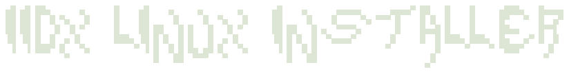

<p align="center">
  
</p>

Automated (unofficial) installer for Beatmania IIDX on Linux with **spicetools**, **bmsound_wine** and **Proton-GE**.

## Requirements

- **Arch-based Linux** (primary target - Debian/Ubuntu/Fedora untested)
- **Steam** installed
- **Legal game dump**
- **Hyprland** or **X11** (other Wayland compositors fall back to manual input)

## Usage

```bash
./install.sh                    # interactive wizard
./install.sh --style 32 --dump <PATH> --monitor DP-1  # pre-filled
```

Interactive setup wizard - no arguments required. All values can be entered through the menu pages. CLI flags are optional and pre-fill values to skip prompts.

### Options

| Argument | Description |
|----------|-------------|
| `--style <NUM>` | Game version number (e.g. `32`) |
| `--dump <PATH>` | Path to game dump directory (must contain a `contents/` folder) |
| `--monitor <n>` | Primary monitor name (e.g. `DP-1`). Game runs on this display. Implicitly enables monitor management. |
| `--secondary-monitor <n>` | Optional. Secondary monitor name (e.g. `HDMI-A-1`). Disabled during gameplay; all monitors fully restored after (position, resolution, rate, rotation). Implicitly enables monitor management. |
| `--rate <HZ>` | Game refresh rate - only used when monitor management is enabled. Default: `120`; use `60` for some dumps/cabinets. |
| `--proton-ver <VER>` | Proton-GE version (default: `8.32`) |
| `--bmsound-ver <VER>` | bmsound_wine version (default: latest) |
| `--spice-date <DATE>` | spicetools date (default: latest) |
| `--steam-home <PATH>` | Steam root path (auto-detected) |
| `--asphyxia-url <URL>` | Asphyxia server URL |
| `--asphyxia-pcbid <ID>` | Cabinet PCBID |
| `--uninstall` | Remove all installed files and optionally revert system changes (packages, groups, services) |
| `--yes` / `-y` | Non-interactive mode |

### Examples

```bash
./install.sh
./install.sh --style 32 --dump /mnt/disk/IIDX/LDJ-012-2025041500 --monitor DP-1
./install.sh --style 32 --dump /mnt/disk/IIDX/LDJ-012-2025041500 --monitor DP-1 --secondary-monitor HDMI-A-1 -y
```

## Launching the game

After installation, launch the game from your application launcher or desktop:

- Search for **Beatmania IIDX <version>** in your app menu
- Or use the `.desktop` file created at `~/.local/share/applications/iidx<version>.desktop`

Monitor management is **disabled by default**. To enable it, answer "yes" when prompted during the installation wizard, or pass `--monitor` (or `--secondary-monitor`/`--rate`) via CLI.

When enabled, the `.desktop` entry uses a helper script (`iidx-mon-state.sh`) that saves/restores all monitor state on every launch:

- **X11**: saves all monitor state, switches primary to game resolution/rate (`xrandr --output <mon> --mode <res> --rate <rate>`), sets `__GL_SYNC_DISPLAY_DEVICE`, runs game, restores everything
- **Hyprland**: saves all monitor state, switches primary to game resolution/rate (`hyprctl keyword monitor <mon>,<res>@<rate>,auto,1`), runs game, restores everything

When disabled, the game launches directly without any display changes.

> **Refresh rate**: Some dumps/cabinets run at 60 Hz, others at 120 Hz. You can set your monitor's refresh rate with `--rate` or via the installer's monitor page. When monitor management is enabled, the desktop entry switches to that rate automatically on every launch. If a dump expects a different rate, the game DLL can also be patched to change it.

If a secondary monitor is configured, it is also disabled during gameplay and re-enabled after:
- **X11**: `xrandr --output <sec> --off`
- **Hyprland**: `hyprctl keyword monitor <sec>,disable`

- **Do not** run `ep_bm2dxnix` directly unless you want to skip display setup.

## What the script does

1. Downloads and patches a dedicated **Proton-GE**
2. Builds **bmsound_wine** (PipeWire audio bridge)
3. Installs **spicetools** (launcher and I/O layer)
4. Sets up symlinks, compatdata and Steam structure
5. Creates `.desktop` launcher entries; optionally with full monitor state save/restore via a helper script
6. Optional **Asphyxia** network configuration (e.g. `https://asphyxia-core.app`)

## Session support

The script auto-detects your display server and compositor via `$XDG_SESSION_TYPE`:

| Session | Monitor detection | Display switching | Helper used | Notes |
|---------|------------------|------------------|-------------|-------|
| **X11** | `xrandr` | `xrandr --output` (resolution, rate, position, rotation) | When enabled | Fully supported |
| **Hyprland** | `hyprctl monitors` | `hyprctl keyword monitor` (resolution, rate, position, transform) | When enabled | Fully supported |
| **Sway** / **Niri** (future) | - | - | - | Easy to add when requested |
| **Other Wayland** | Manual input only | None | Never | Fallback, no auto-detection |

Monitor management is off by default. When enabled, the helper saves the full state of all monitors before the game and restores it after - position, resolution, refresh rate, and rotation/transform are preserved. The primary monitor is always switched to the configured game resolution and refresh rate, regardless of whether a secondary monitor is present.

## Asphyxia

[**Asphyxia**](https://asphyxia-core.github.io) is a server emulator for rhythm games that allows you to play online with score saving, events, and unlocks without an official e-amusement pass.

The installer can configure the game to connect to an Asphyxia server:

- `--asphyxia-url <URL>` - server URL (default: `http://127.0.0.1:1108/`)
- `--asphyxia-pcbid <ID>` - cabinet ID for identification

You can also enter these values interactively during the **Network** page of the wizard.

Refer to the [Asphyxia documentation](https://github.com/asphyxia-core/asphyxia-core.github.io) for setup instructions.

## Credits

- [nixac](https://codeberg.org/nixac) - guide, spicetools, bmsound_wine, automatization
- [GloriousEggroll](https://github.com/GloriousEggroll/proton-ge-custom) - Proton-GE
- [Asphyxia](https://asphyxia-core.github.io) - server emulator

> This installer is unofficial. Refer to the [upstream guide](https://nixac.codeberg.page) for authoritative information.
>
> Licensed under the [MIT License](LICENSE).
