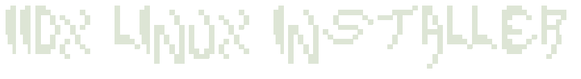

<p align="center">
  
</p>

Automated (unofficial) installer for Beatmania IIDX on Linux with **spicetools**, **bmsound_wine** and **Proton-GE**.

## Requirements

- **Arch-based Linux** or **Void Linux x86_64 glibc** (Debian/Ubuntu/Fedora untested)
- **Steam** installed
- **Legal game dump**
- **KDE Plasma Wayland**, **Hyprland** or **X11** for automatic monitor management

> Void's musl edition is not supported. Steam/Proton and Void's official
> multilib repositories require the x86_64 glibc edition.

## Usage

```bash
./install.sh                    # interactive wizard
./install.sh --style 32 --dump <PATH> --monitor DP-1  # pre-filled
```

Run the installer as your regular desktop user, never with `sudo`. It requests
`sudo` itself for individual system operations. Running the whole script as
root is rejected because it would use root's home, Steam and application paths.

Interactive setup wizard - no arguments required. All values can be entered through the menu pages. CLI flags are optional and pre-fill values to skip prompts.

### Options

| Argument | Required | Default | Description |
|----------|----------|---------|-------------|
| `--style <NUM>` | With `-y` | — | Game version number (e.g. `32`) |
| `--dump <PATH>` | With `-y` | — | Path to game dump directory (must contain a `contents/` folder) |
| `--monitor <n>` | No | (prompted) | Primary monitor name (e.g. `DP-1`). Implicitly enables monitor management. |
| `--secondary-monitor <n>` | No | (prompted) | Secondary monitor name (e.g. `HDMI-A-1`). Disabled during gameplay. Implicitly enables monitor management. |
| `--rate <HZ>` | No | `120` | Monitor target rate. Only used when monitor management is enabled. |
| `--proton-ver <VER>` | No | `8.32` | Proton-GE version |
| `--bmsound-ver <VER>` | No | latest | bmsound_wine version |
| `--spice-date <DATE>` | No | latest | spicetools release date |
| `--steam-home <PATH>` | No | auto-detected | Steam root path |
| `--asphyxia-url <URL>` | No | `http://127.0.0.1:1108/` | Asphyxia server URL |
| `--asphyxia-pcbid <ID>` | No | `00010203040506070809` | Cabinet PCBID |
| `--uninstall` | No | — | Remove all installed files and optionally revert system changes |
| `--yes` / `-y` | No | — | Non-interactive mode. Requires `--style` and `--dump`. All other prompts use their default values. |

### Examples

```bash
./install.sh
./install.sh --style 32 --dump /mnt/disk/IIDX/LDJ-012-2025041500 --monitor DP-1
./install.sh --style 32 --dump /mnt/disk/IIDX/LDJ-012-2025041500 --monitor DP-1 --secondary-monitor HDMI-A-1 -y
```

## Launching the game

After installation, launch the game from your application launcher or desktop:

- Search for **Beatmania IIDX <version>** in your app menu
- Or use the `.desktop` file created at `~/.local/share/applications/iidx<version>.desktop`

Monitor management is **disabled by default**. To enable it, answer "yes" when prompted during the installation wizard, or pass `--monitor` (or `--secondary-monitor`/`--rate`) via CLI.

When enabled, the `.desktop` entry uses a helper script (`iidx-mon-state.sh`) that saves/restores all monitor state on every launch:

- **X11**: saves all monitor state, switches primary to game resolution/rate (`xrandr --output <mon> --mode <res> --rate <rate>`), sets `__GL_SYNC_DISPLAY_DEVICE`, runs game, restores everything
- **Hyprland**: saves all monitor state, switches primary to game resolution/rate (`hyprctl keyword monitor <mon>,<res>@<rate>,auto,1`), runs game, restores everything
- **KDE Plasma Wayland**: saves the KScreen JSON state, switches mode and primary output with `kscreen-doctor`, runs the game, then restores enabled outputs, modes, positions, scale, rotation and priority

When disabled, the game launches directly without any display changes.

> **Refresh rate**: Some dumps/cabinets run at 60 Hz, others at 120 Hz. You can set your monitor's refresh rate with `--rate` or via the installer's monitor page. When monitor management is enabled, the desktop entry switches to that rate automatically on every launch. If a dump expects a different rate, the game DLL can also be patched to change it.

If a secondary monitor is configured, it is also disabled during gameplay and re-enabled after:
- **X11**: `xrandr --output <sec> --off`
- **Hyprland**: `hyprctl keyword monitor <sec>,disable`
- **KDE Plasma Wayland**: `kscreen-doctor output.<sec>.disable`

- **Do not** run `ep_bm2dxnix` directly unless you want to skip display setup.

## What the script does

1. Downloads and patches a dedicated **Proton-GE**
2. Builds **bmsound_wine** (PipeWire audio bridge)
3. Installs **spicetools** (launcher and I/O layer)
4. Sets up symlinks, compatdata and Steam structure
5. Creates `.desktop` launcher entries; optionally with full monitor state save/restore via a helper script
6. **Asphyxia** network configuration (e.g. `https://asphyxia-core.app`)

## Build dependencies

The installer verifies the tools and development interfaces required to compile
`bmsound_wine`, rather than only checking the runtime commands:

| Requirement | Arch | Void |
|-------------|------|------|
| CMake | `cmake` | `cmake` |
| pkg-config command | `pkgconf` | `pkg-config` |
| Wine build tools and headers | `wine` or `wine-staging` | `wine-tools` + `wine-devel` |
| PipeWire headers/pkg-config | `libpipewire` | `pipewire-devel` |
| FFmpeg headers/pkg-config | `ffmpeg` | `ffmpeg6-devel` |

Before building, the installer checks `winegcc`, `winebuild`, the Wine
development header `windef.h`, and the
`libpipewire-0.3`, `libspa-0.2`, `libavformat`, `libavcodec`, `libavutil` and
`libswresample` pkg-config modules. `bmsound_wine v0.2.4` requires the modern
FFmpeg channel-layout API (`libavutil` 57 or newer), so Void's legacy
`ffmpeg-devel` package is not sufficient.

Only the `bmsound-pw` and `bmsound-wine` production artifacts are built.
Upstream test programs are skipped, so test-only headers such as `libsndfile`
are not required.

## Vulkan prerequisites

On Arch and Void, the installer detects AMD, Intel and NVIDIA GPUs and validates
both the 64-bit and 32-bit Vulkan loader and ICD. It reports the packages needed
for the detected hardware without changing graphics drivers automatically:

| GPU | Arch (64-bit / 32-bit) | Void (64-bit / 32-bit) |
|-----|--------------------------|-------------------------|
| AMD | `vulkan-radeon` / `lib32-vulkan-radeon` | `mesa-vulkan-radeon` / `mesa-vulkan-radeon-32bit` |
| Intel | `vulkan-intel` / `lib32-vulkan-intel` | `mesa-vulkan-intel` / `mesa-vulkan-intel-32bit` |
| NVIDIA | `nvidia-utils` / `lib32-nvidia-utils` | `nvidia-libs` / `nvidia-libs-32bit` |
| NVIDIA (NVK) | `vulkan-nouveau` / `lib32-vulkan-nouveau` | `mesa-vulkan-nouveau` / `mesa-vulkan-nouveau-32bit` |

## Void Linux

Void Linux support targets the `x86_64 glibc` edition. The installer uses
`xbps-query` and `xbps-install`, and can enable `void-repo-multilib` after
confirmation when Proton's 32-bit libraries are missing.

Steam must already be installed. If it was installed from the Void repository,
`void-repo-nonfree` must be enabled. NVIDIA's proprietary 32-bit package also
requires `void-repo-multilib-nonfree`.

Void does not use systemd user services for PipeWire. The installer checks that
PipeWire and WirePlumber are active but does not alter the existing audio session.
If the check fails, follow the
[Void PipeWire handbook](https://docs.voidlinux.org/config/media/pipewire.html),
then log out and back in before re-running the installer.

## Session support

The script detects the display server from `$XDG_SESSION_TYPE` and identifies
Plasma from `$XDG_CURRENT_DESKTOP`, `$DESKTOP_SESSION` or `$KDE_FULL_SESSION`:

| Session | Monitor detection | Display switching | Helper used | Notes |
|---------|------------------|------------------|-------------|-------|
| **X11** | `xrandr` | `xrandr --output` (resolution, rate, position, rotation) | When enabled | Fully supported |
| **Hyprland** | `hyprctl monitors` | `hyprctl keyword monitor` (resolution, rate, position, transform) | When enabled | Fully supported |
| **KDE Plasma Wayland** | `kscreen-doctor -o` | `kscreen-doctor` (mode, priority, enabled outputs) | When enabled | Fully supported; requires `jq` and `kscreen-doctor` (`libkscreen` on Arch, `libkf6screen` on Void) |
| **Sway** / **Niri** (future) | - | - | - | Easy to add when requested |
| **Other Wayland / non-graphical session** | None | None | Never | Warns and skips monitor configuration |

Monitor management is off by default. When enabled, the helper saves the full state of all monitors before the game and restores it after - position, resolution, refresh rate, and rotation/transform are preserved. The primary monitor is always switched to the configured game resolution and refresh rate, regardless of whether a secondary monitor is present.

Unsupported sessions cannot enable monitor management, including through CLI
monitor flags. The installer reports the unsupported session, clears those
settings and creates direct launchers that never call `xrandr`, `hyprctl` or
`kscreen-doctor`.

## Asphyxia

[**Asphyxia**](https://asphyxia-core.github.io) is a server emulator for rhythm games that allows you to play online with score saving, events, and unlocks without an official e-amusement pass.

The installer can configure the game to connect to an Asphyxia server:

- `--asphyxia-url <URL>` - server URL (default: `http://127.0.0.1:1108/`)
- `--asphyxia-pcbid <ID>` - cabinet ID for identification

You can also enter these values interactively during the **Network** page of the wizard.

With `--yes` (non-interactive), Asphyxia will be configured using the provided flags or the defaults above.

If you want to change the server or cabinet ID after installation, edit the `"network"` section in `contents/prop/linux.json` inside your dump directory.

Refer to the [Asphyxia documentation](https://github.com/asphyxia-core/asphyxia-core.github.io) for setup instructions.

## Credits

- [nixac](https://codeberg.org/nixac) - guide, spicetools, bmsound_wine, automatization
- [GloriousEggroll](https://github.com/GloriousEggroll/proton-ge-custom) - Proton-GE
- [Asphyxia](https://asphyxia-core.github.io) - server emulator

> This installer is unofficial. Refer to the [upstream guide](https://nixac.codeberg.page) for authoritative information.
>
> Licensed under the [MIT License](LICENSE).
